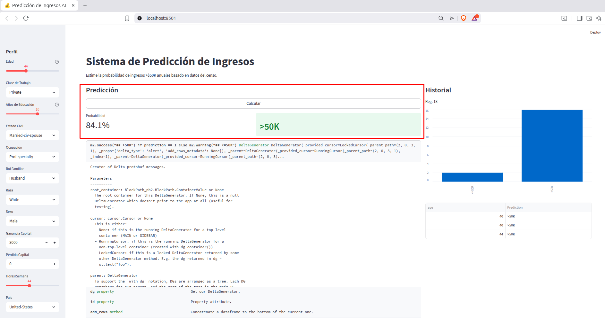
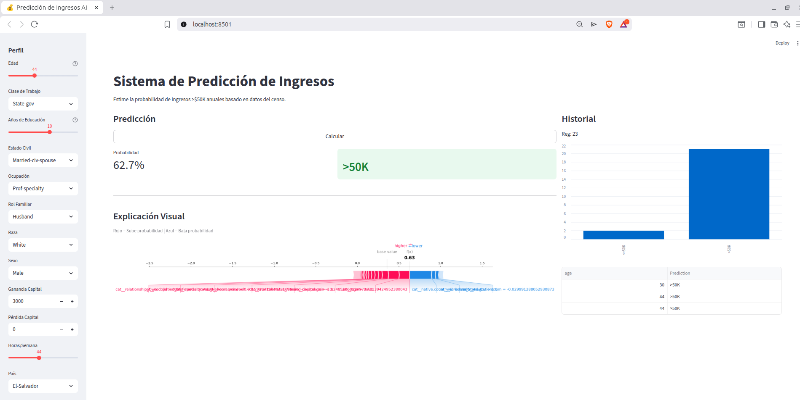

# 💰 Predicción de Ingresos con Deep Learning (Adult Census) - Sumativa 2


Este proyecto corresponde a la **Evaluación Sumativa 2** del curso ACIF104. El objetivo es desarrollar y desplegar un modelo de Deep Learning robusto capaz de predecir si un individuo percibe ingresos anuales superiores a $50,000 USD, basándose en datos sociodemográficos sensibles, con un fuerte enfoque en la **ética, la explicabilidad (XAI) y el monitoreo**.

## 📋 Tabla de Contenidos
- [Descripción del Proyecto](#-descripción-del-proyecto)
- [Metodología](#-metodología)
- [Tecnologías Utilizadas](#-tecnologías-utilizadas)
- [Resultados Clave](#-resultados-clave)
- [Estructura del Repositorio](#-estructura-del-repositorio)
- [Instalación y Configuración](#-instalación-y-configuración)
- [Ejecución de la Aplicación (API)](#-ejecución-de-la-aplicación-api)
- [Ejecución en Google Colab](#-ejecución-en-google-colab)
- [Autores](#-autores)

## 🧐 Descripción del Proyecto
Utilizando el dataset "Adult Census", este proyecto implementa una metodología completa CRISP-DM que incluye:
1.  **Análisis Exploratorio (EDA):** Detección de desbalance severo y sesgos en variables sensibles.
2.  **Modelado:** Comparación de arquitecturas de Deep Learning (MLP vs Wide & Deep). El modelo ganador utiliza **Dropout** para mejorar la generalización.
3.  **Despliegue:** Una aplicación web interactiva que permite realizar inferencias en tiempo real.
4.  **Ética y Monitoreo:** Estrategias para mitigar sesgos y vigilar el *data drift* en producción.


## 🚀 Metodología
El proyecto sigue un flujo de trabajo de Ciencia de Datos riguroso:

1.  **EDA y Limpieza:** Manejo de valores nulos (`?`), análisis de outliers y eliminación de redundancias (`education` vs `education-num`).
2.  **Preprocesamiento:** Pipeline con `StandardScaler` para numéricas y `OneHotEncoder` para categóricas.
3.  **Machine Learning Clásico (Baseline):** Comparativa entre Regresión Logística, Random Forest y SVM.
4.  **Estrategias de Balanceo:** Pruebas con *Baseline*, *SMOTE* y *Class Weights*.
5.  **Deep Learning:** Implementación y comparación de tres arquitecturas:
    * MLP Básico.
    * MLP con Regularización (Dropout).
    * Arquitectura Wide & Deep.
6.  **Refinamiento:** Ajuste de hiperparámetros automatizado usando **KerasTuner**.
7.  **Explicabilidad:** Análisis interpretativo del modelo final utilizando **SHAP** (SHapley Additive exPlanations).

## 🛠 Tecnologías Utilizadas
* **Python 3**
* **Pandas & NumPy:** Manipulación de datos.
* **Matplotlib & Seaborn:** Visualización de datos.
* **Scikit-Learn:** Preprocesamiento y modelos clásicos.
* **TensorFlow / Keras:** Construcción de redes neuronales.
* **Keras Tuner:** Optimización de hiperparámetros.
* **Imbalanced-learn:** Técnica SMOTE.
* **SHAP:** Interpretabilidad del modelo.

## 🏆 Resultados Clave

Tras experimentar con múltiples arquitecturas, el modelo **MLP con Dropout (30%)** resultó ser el ganador, superando incluso a modelos optimizados automáticamente y arquitecturas híbridas complejas. Esto demostró la importancia de la regularización simple frente al desbalance de datos.

| Modelo | F1-Score (>50K) | AUC-ROC | Conclusión |
| :--- | :---: | :---: | :--- |
| **MLP + Dropout (Ganador)** | **0.6836** | **0.9071** | Mejor equilibrio y generalización. |
| Wide & Deep | 0.6812 | 0.9058 | Muy competitivo, arquitectura robusta. |
| MLP Optimizado (Tuner) | 0.6804 | 0.9070 | Excelente AUC, pero menor F1. |
| MLP Básico | 0.6774 | 0.9024 | Buen baseline, tiende al sobreajuste. |

**Insights de SHAP:**
El análisis de interpretabilidad reveló que el **Estado Civil** (específicamente estar casado), la **Edad**, los **Años de Educación** y las **Ganancias de Capital** son los predictores más fuertes para tener ingresos altos.


## 📂 Estructura del Repositorio

El proyecto está organizado de manera modular para separar el análisis, la documentación y el despliegue:

```text
├── API/                          # Módulo de la Aplicación Web
│   ├── adult.csv                 # Dataset fuente
│   ├── app.py                    # Código principal de la aplicación Streamlit
│   ├── backup_app.py             # Versión de respaldo de la app
│   ├── entrenar_local.py         # Script para regenerar modelos localmente
│   ├── modelo_ingresos.keras     # Modelo de Red Neuronal entrenado
│   ├── preprocessor.joblib       # Pipeline de preprocesamiento
│   ├── shap_background.joblib    # Datos de fondo para explicabilidad SHAP
│   ├── columnas_input.joblib     # Metadatos de columnas
│   ├── prediction_logs.csv       # Registro (log) de predicciones
│   ├── roc_curves_comparison.png # Gráfico de rendimiento
│   └── requeriments.txt          # Dependencias específicas de la API
│
├── Informe/                      # Documentación Formal
│   └── ACIF104_S10_Grupo13.docx  # Informe final detallado
│
├── Images/                      # Documentación Formal
│   └── Prediction1.txt          # Informe final detallado
│   └── Prediction2.txt          # Informe final detallado
│
├── Notebook/                     # Análisis y Experimentación
│   └── ACIF104_S10_Grupo13.ipynb # Jupyter Notebook con todo el código del proyecto
│
├── README.md                     # Este archivo
└── requeriments.txt              # Dependencias generales del proyecto

```

## 🔧 Instalación y Configuración

Sigue estos pasos para ejecutar el proyecto en tu entorno local (Linux/Mac/Windows).

### 1. Clonar el Repositorio
```
git clone [https://github.com/MaidoniaN/ACIF104-Sumativa2-Grupo13.git](https://github.com/MaidoniaN/ACIF104-Sumativa2-Grupo13.git)
cd ACIF104-Sumativa2-Grupo13
```

### 2. Configurar Entorno Virtual (Recomendado)
Para evitar conflictos de versiones, crea un entorno aislado:

```
# Crear entorno
python3 -m venv venv

# Activar entorno (Linux/Mac)
source venv/bin/activate

# Activar entorno (Windows)
venv\Scripts\activate
```

### 3. Instalar Dependencias
Instala las librerías necesarias listadas en el archivo raíz. (Nota: Asegúrate de usar el nombre exacto del archivo que tienes en tu carpeta)

```
pip install -r requeriments.txt.
```

## 🚀 Ejecución de la Aplicación (API)
La aplicación web (Frontend + Backend) se encuentra en la carpeta API. Es importante ejecutarla desde allí para que encuentre los archivos .keras y .csv correctamente.

### Paso 1: Navegar a la carpeta API
```
cd API
```

### Paso 2: (Opcional) Regenerar Artefactos Locales Si tienes problemas de compatibilidad al cargar el modelo (errores de sklearn o versiones), ejecuta este script para re-entrenar y guardar el modelo en tu máquina:


```
python3 entrenar_local.py
```

Espera a ver el mensaje: "¡LISTO! Archivos generados correctamente."

### Paso 3: Iniciar la App

Ejecutar el siguiente comando en el directorio API

```
streamlit run app.py
```


La aplicación se abrirá automáticamente en tu navegador en http://localhost:8501.
Una vez que inicia con la aplicación, podemos hacer predicciones.
Para ello debemos realizar lo siguiente:
1. Seteamos los parámetros de la barra de la izquierda de acuerdo con las características de un sujeto de interés.

- Edad
- Clase de Trabajo
- Años de educación
- Nacionalidad
- etc

2. Luego presionamos "Calcular". El algoritmo ejecutara el modelo predictivo y nos entregara una respuesta.

Para el caso de la imagen, el sujeto tiene un 85.6% de "Probabilidades" de obtener 50Mil al año.



Ahora bien, para una segunda predicción, solo se modifico la característica del País, paso de "Estados Unidos" a "El Salvador" y el resultado de la predicción es mas baja, obteniendo solo un 62.7% de "Probabilidades" de ganar mas de 50Mil al año.




## ☁ Ejecución en Google Colab

Si prefieres revisar el análisis sin instalar nada localmente:

1. Abre el archivo Notebook/ACIF104_S10_Grupo13.ipynb en el repositorio de GitHub.

2. Haz clic en el botón "Open in Colab" (si está disponible) o descarga el archivo y súbelo a Google Colab.

3. Para cargar el dataset y utilidades, ejecuta en la primera celda del notebook:

```
!git clone [https://github.com/MaidoniaN/ACIF104-Sumativa2-Grupo13.git](https://github.com/MaidoniaN/ACIF104-Sumativa2-Grupo13.git)
%cd ACIF104-Sumativa2-Grupo13/API
!pip install -r requeriments.txt
```

## 👥 Autores
### Grupo 13 - Aprendizaje de Máquinas (ACIF104)
- Alonso Cid Riveros
- Scarlett Espinoza Contreras
- Christian Mattioni Avila
